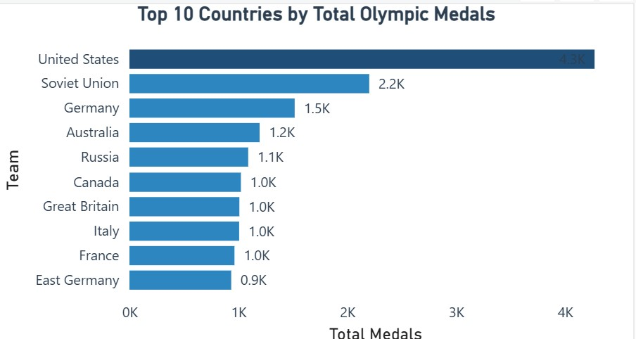

# olympic-medal-analysis-dashboard
Power BI dashboard analysing Olympic athlete performance and medal trends
**Olympic Medal Analysis Dashboard
**
This project analyses historical Olympic data to identify trends in athlete performance, medal distribution, and country dominance.

**Tools Used**
Power BI
Data Cleaning & Transformation
DAX (Data Analysis Expressions)
**Key Features**
KPI metrics: Total Athletes, Total Medals, Average Age
Top 10 Countries by medal count
Top 10 Sports by medal distribution
Time-series analysis of Olympic medal trends
Interactive filtering using slicers
**Key Insights**
The United States dominates overall medal count
Athletics and Swimming contribute the highest number of medals
Medal distribution is concentrated among a few countries
Trends vary due to differences between Olympic event types
**Files**
Olympic Dashboard (.pbix)
Dashboard Screenshots

