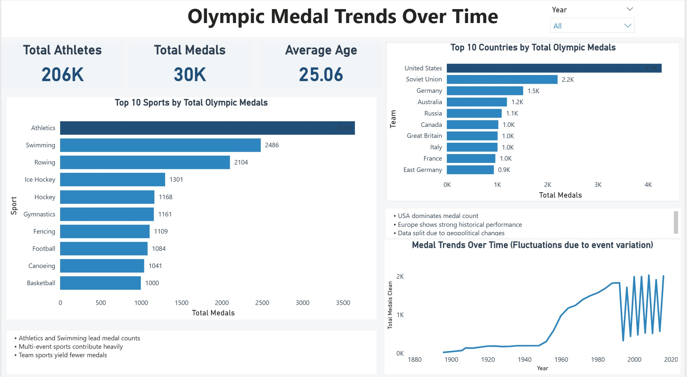
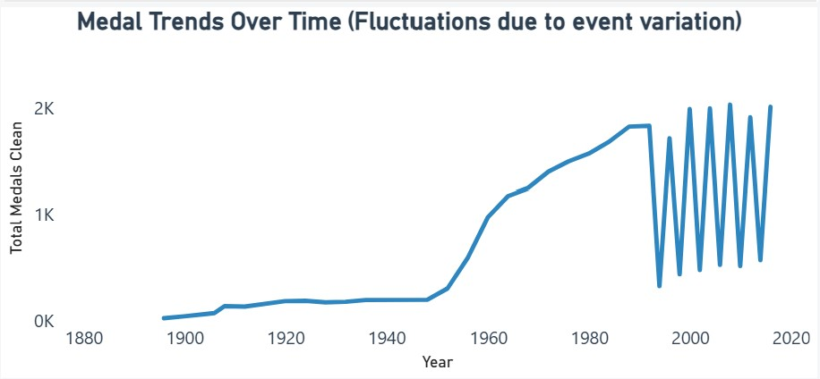
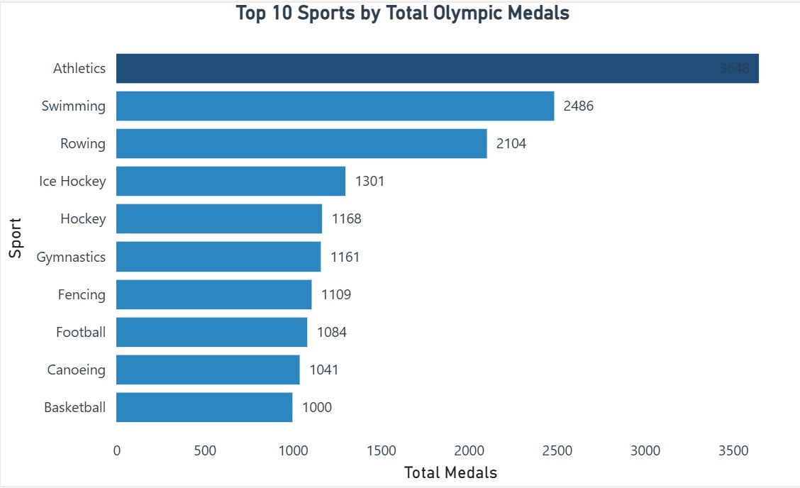

# Olympic Medal Analysis Dashboard

Power BI dashboard analysing Olympic athlete performance and medal trends.

This project explores historical Olympic data to identify patterns in athlete demographics, medal distribution, and country dominance using interactive visualisations.

---

## Tools Used
- Power BI  
- Data Cleaning & Transformation  
- DAX (Data Analysis Expressions)  

---

## Key Features
- KPI metrics: Total Athletes, Total Medals, Average Age  
- Top 10 Countries by total medal count  
- Top 10 Sports by medal distribution  
- Time-series analysis of Olympic medal trends  
- Interactive filtering using slicers  

---

## Key Insights
- The United States dominates overall Olympic medal count  
- Athletics and Swimming contribute the highest number of medals  
- Medal distribution is concentrated among a few countries  
- Trends vary due to differences between Olympic event types (e.g., Summer vs Winter Games)  

---

## Files
- Olympic Dashboard (.pbix)  
- Dashboard Screenshots  

---

## Dashboard Preview

---

## Medal Trends Over Time

---

## Top Countries

---

## Top Sports

---

## Project Overview

This dashboard was developed to demonstrate data analysis, data visualisation, and storytelling skills using Power BI. The project focuses on transforming raw Olympic data into meaningful insights through structured analysis and interactive reporting.

---

## How to Use
1. Download the `.pbix` file  
2. Open in Power BI Desktop  
3. Use filters (e.g., Year) to explore different trends  

---

## Author
Kirthi Chetty
